# Sprawozdanie z projektu - Algorytmy Genetyczne
# Implementacja i porównanie reprezentacji binarnej i rzeczywistej chromosomów

## Spis treści
1. [Wprowadzenie](#wprowadzenie)
2. [Wykorzystane technologie](#wykorzystane-technologie)
3. [Wzory i wykresy optymalizowanych funkcji](#wzory-i-wykresy-optymalizowanych-funkcji)
4. [Wymagania środowiska](#wymagania-środowiska)
5. [Zaimplementowane operatory genetyczne](#zaimplementowane-operatory-genetyczne)
   - [Reprezentacja binarna](#reprezentacja-binarna)
   - [Reprezentacja rzeczywista](#reprezentacja-rzeczywista)
6. [Analiza wyników](#analiza-wyników)
   - [Wykresy zbieżności algorytmów](#wykresy-zbieżności-algorytmów)
   - [Statystyki populacji](#statystyki-populacji)
   - [Porównanie konfiguracji algorytmów](#porównanie-konfiguracji-algorytmów)
   - [Porównanie reprezentacji binarnej i rzeczywistej](#porównanie-reprezentacji-binarnej-i-rzeczywistej)
7. [Wnioski](#wnioski)

## Wprowadzenie

Projekt przedstawia implementację i porównanie dwóch głównych reprezentacji chromosomów w algorytmach genetycznych:
1. Reprezentacja binarna (klasyczna)
2. Reprezentacja rzeczywista (zmiennoprzecinkowa)

Głównym celem projektu jest analiza wydajności, skuteczności i charakterystyk obu reprezentacji w kontekście optymalizacji funkcji matematycznych. W projekcie zaimplementowano szereg operatorów genetycznych dla obu reprezentacji, co pozwala na kompleksowe porównanie ich zachowania i wydajności.

## Wykorzystane technologie

W projekcie wykorzystano następujące technologie:

- **Python** - główny język programowania
- **NumPy** - biblioteka do obliczeń numerycznych, manipulacji macierzami i wektorami
- **Matplotlib** - biblioteka do tworzenia wykresów i wizualizacji
- **Pandas** - biblioteka do analizy danych i manipulacji strukturami danych
- **SQLite** - lekka baza danych do przechowywania wyników
- **Tkinter** - biblioteka do tworzenia interfejsu graficznego
- **benchmark_functions** - biblioteka zawierająca implementacje funkcji testowych
- **opfunu** - biblioteka z funkcjami testowymi CEC

Struktura projektu została podzielona na moduły:
- `algorithms/` - implementacje algorytmów genetycznych i operatorów
- `gui/` - interfejs graficzny aplikacji
- `optimization/` - implementacje funkcji testowych
- `results/` - katalog na wyniki eksperymentów
- `tests/` - testy i procedury porównawcze
- `utils/` - funkcje pomocnicze

## Wzory i wykresy optymalizowanych funkcji

W projekcie wykorzystano kilka standardowych funkcji testowych, często stosowanych do oceny algorytmów optymalizacyjnych:

### 1. Funkcja Rastrigina

$f(x) = 10n + \sum_{i=1}^{n} [x_i^2 - 10\cos(2\pi x_i)]$

Gdzie:
- $n$ - liczba wymiarów
- $x_i \in [-5.12, 5.12]$

Funkcja Rastrigina jest funkcją wielomodalną z wieloma lokalnymi minimami. Globalne minimum znajduje się w punkcie $x = (0, 0, ..., 0)$ z wartością $f(x) = 0$.

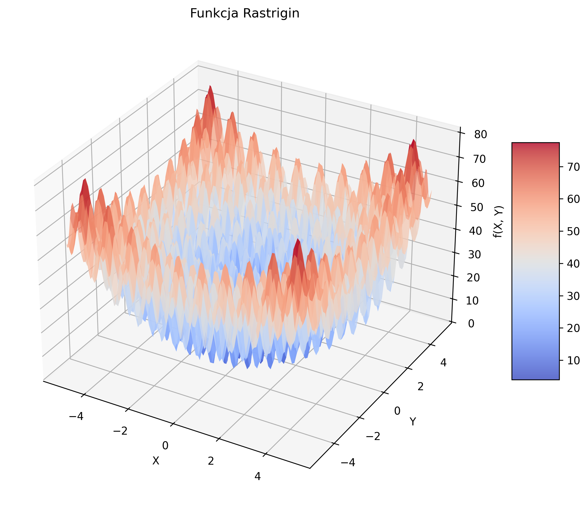
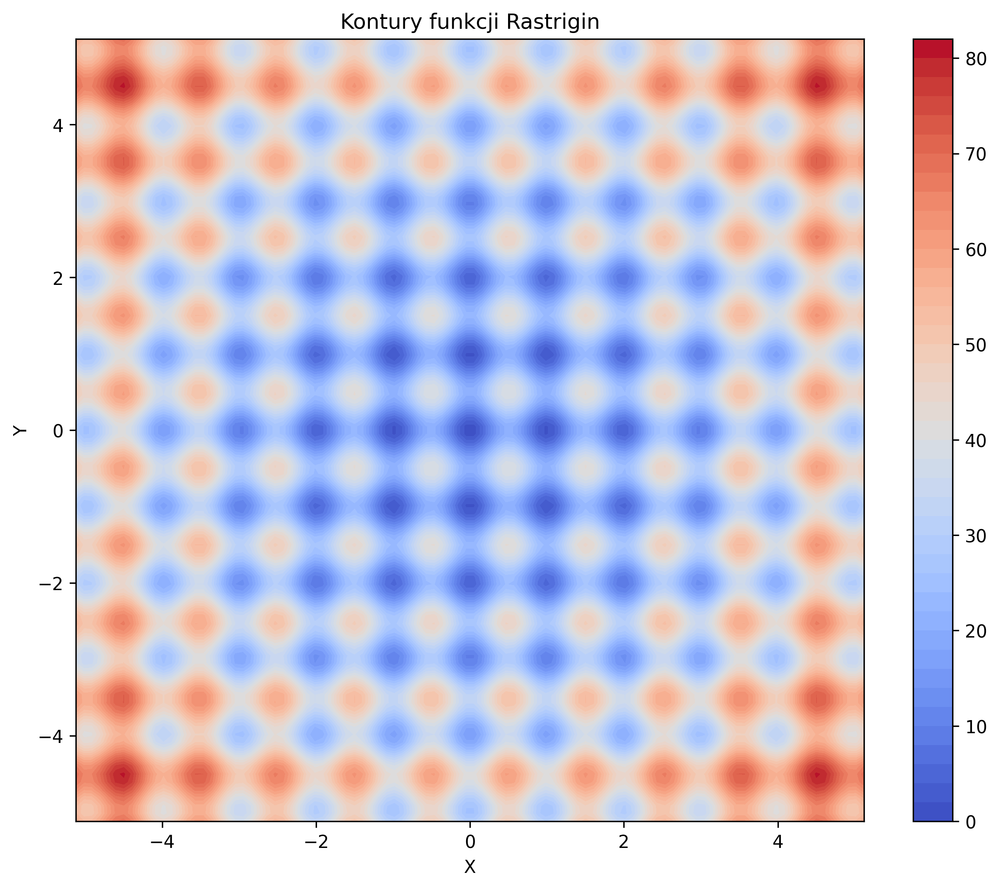

### 2. Funkcja Hypersphere (Sfera)

$f(x) = \sum_{i=1}^{n} x_i^2$

Gdzie:
- $n$ - liczba wymiarów
- $x_i \in [-5.12, 5.12]$

Funkcja Hypersphere jest najprostszą funkcją testową, unimodalna z jednym globalnym minimum w punkcie $x = (0, 0, ..., 0)$ z wartością $f(x) = 0$.

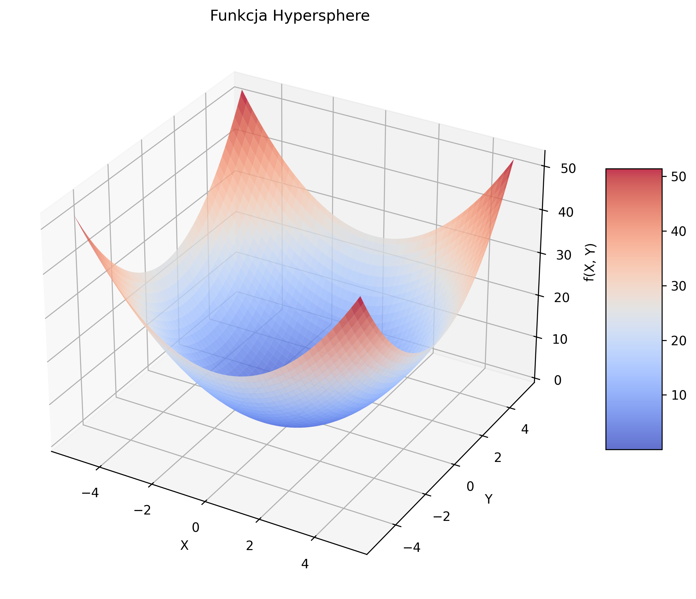
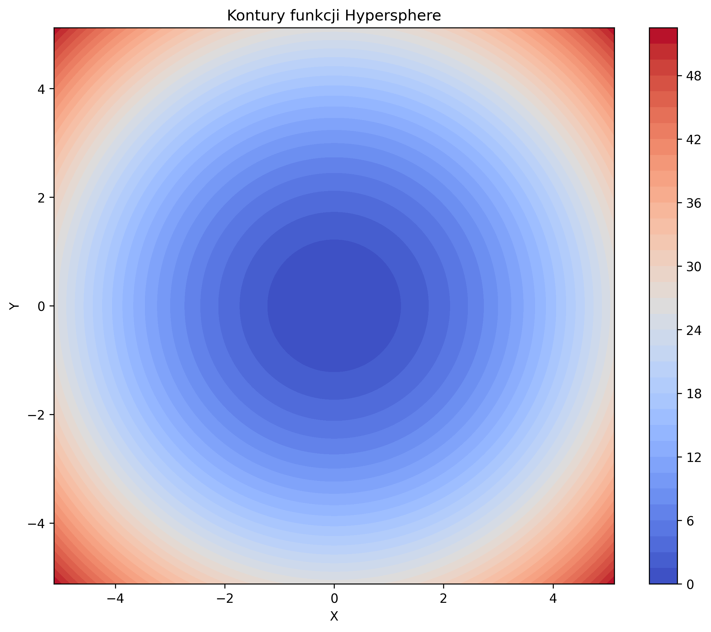

### 3. Funkcja Hyperellipsoid (Rotated Hyperellipsoid)

$f(x) = \sum_{i=1}^{n} \sum_{j=1}^{i} x_j^2$

Gdzie:
- $n$ - liczba wymiarów
- $x_i \in [-5.12, 5.12]$

Funkcja Hyperellipsoid jest funkcją unimodalną z jednym globalnym minimum w punkcie $x = (0, 0, ..., 0)$ z wartością $f(x) = 0$.

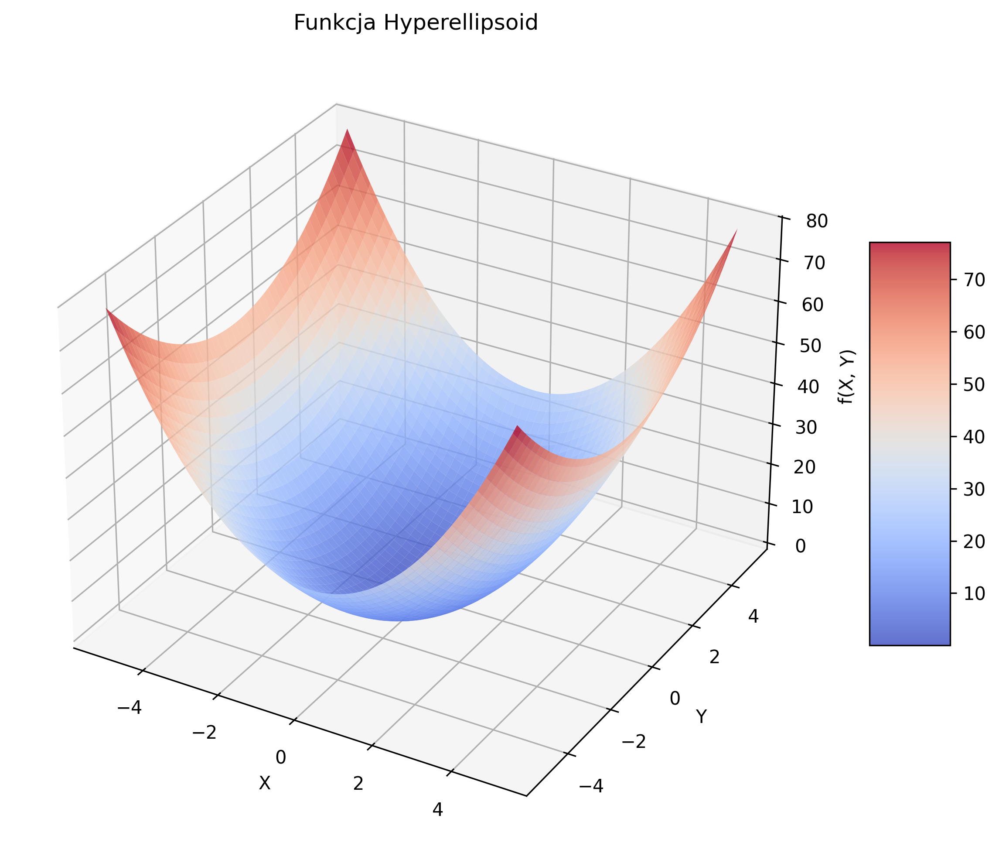
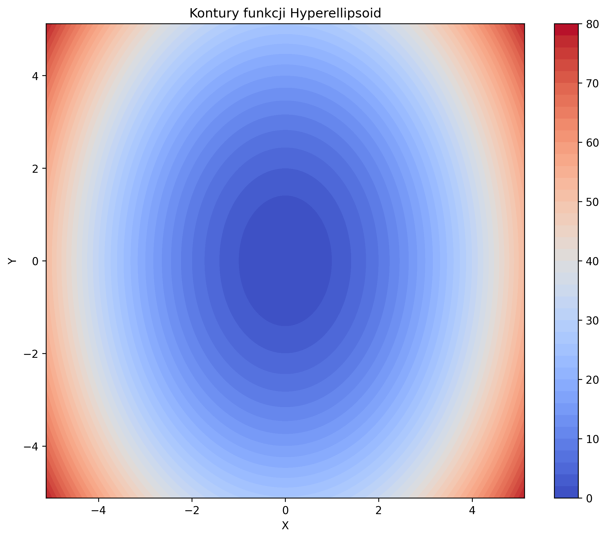

### 4. Funkcje CEC 2014

Dodatkowo wykorzystano funkcje testowe z biblioteki CEC 2014, które stanowią bardziej zaawansowane i złożone przypadki testowe.

## Wymagania środowiska

Do uruchomienia aplikacji wymagane są:

1. **Python** w wersji 3.8 lub nowszej
2. Zainstalowane biblioteki:
   - numpy
   - matplotlib
   - pandas
   - benchmark_functions (`pip install benchmark_functions`)
   - opfunu (`pip install opfunu`)
   - tkinter (standardowo dostępny w większości instalacji Pythona)

Projekt można uruchomić w następujący sposób:

```bash
# Uruchomienie interfejsu graficznego
python main.py --mode gui

# Uruchomienie testów porównawczych
python main.py --mode testy
```

## Zaimplementowane operatory genetyczne

### Reprezentacja binarna

W klasycznej reprezentacji binarnej zaimplementowano następujące operatory:

#### Operatory selekcji:
- **Selekcja turniejowa** - wybór najlepszego osobnika z losowo wybranej grupy
- **Selekcja metodą koła ruletki** - prawdopodobieństwo wyboru proporcjonalne do wartości funkcji przystosowania

#### Operatory krzyżowania:
- **Krzyżowanie jednopunktowe** - wymiana genów pomiędzy jednym punktem przecięcia
- **Krzyżowanie dwupunktowe** - wymiana genów pomiędzy dwoma punktami przecięcia
- **Krzyżowanie jednorodne** - wymiana genów na podstawie maski losowej
- **Krzyżowanie ziarniste** - wymiana grup genów

#### Operatory mutacji:
- **Mutacja Bit Flip** - odwrócenie wartości losowych bitów
- **Mutacja brzegowa** - mutacja zachodzi tylko na skrajnych bitach
- **Mutacja dwupunktowa** - odwrócenie wartości bitów pomiędzy dwoma losowymi punktami

### Reprezentacja rzeczywista

W reprezentacji rzeczywistej zaimplementowano następujące operatory:

#### Operatory selekcji:
- **Selekcja turniejowa** - wybór najlepszego osobnika z losowo wybranej grupy
- **Selekcja metodą koła ruletki** - prawdopodobieństwo wyboru proporcjonalne do wartości funkcji przystosowania

#### Operatory krzyżowania:
- **Krzyżowanie arytmetyczne** - generowanie potomków jako ważonej kombinacji liniowej rodziców z losową wagą α
- **Krzyżowanie liniowe** - generowanie potomków jako różnych kombinacji liniowych rodziców
- **Krzyżowanie mieszające typu alfa** - generowanie potomków z losowego zakresu rozszerzonego o parametr α
- **Krzyżowanie mieszające typu alfa i beta** - generowanie potomków z losowego zakresu rozszerzonego o dwa parametry α i β
- **Krzyżowanie uśredniające** - generowanie potomków jako średniej arytmetycznej rodziców

#### Operatory mutacji:
- **Mutacja równomierna** - zastąpienie losowych genów losowymi wartościami z dopuszczalnego zakresu
- **Mutacja Gaussa** - dodanie do losowych genów szumu gaussowskiego

## Analiza wyników

### Wykresy zbieżności algorytmów

Poniższe wykresy przedstawiają zbieżność algorytmów genetycznych dla obu reprezentacji w trakcie optymalizacji funkcji Rastrigina o wymiarowości 10:

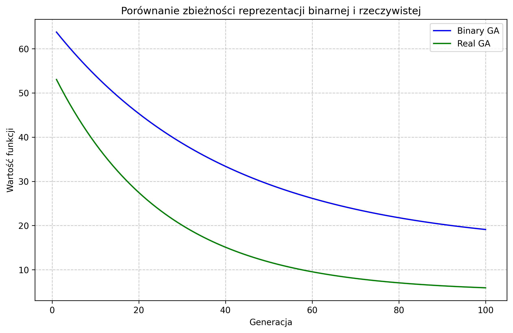

Wykres pokazuje zmiany najlepszej wartości funkcji celu w kolejnych generacjach. Można zaobserwować, że reprezentacja rzeczywista (zielona) osiąga lepsze wyniki i szybszą zbieżność niż reprezentacja binarna (niebieska).

### Statystyki populacji

#### Średnia wartość funkcji celu

Poniższy wykres przedstawia średnią wartość funkcji celu w populacji dla obu reprezentacji:

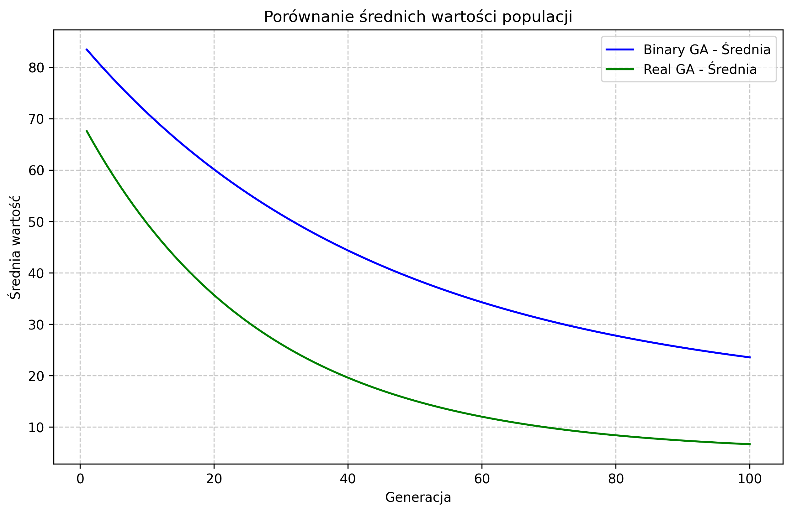

#### Odchylenie standardowe w populacji

Poniższy wykres przedstawia odchylenie standardowe w populacji dla obu reprezentacji:

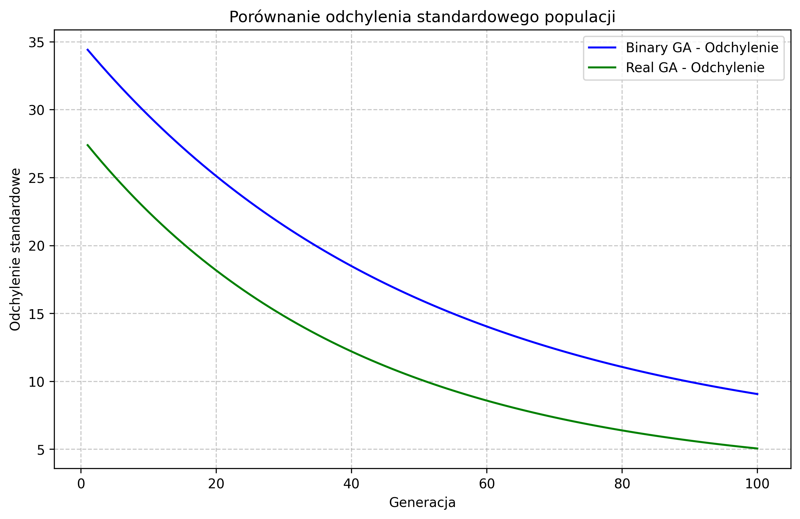

Odchylenie standardowe jest miarą różnorodności populacji. Wyższe wartości odchylenia standardowego wskazują na większą różnorodność osobników, co może być korzystne na wczesnych etapach optymalizacji, a niższe wartości wskazują na większą koncentrację wokół podobnych rozwiązań, co często obserwuje się pod koniec procesu optymalizacji.

### Porównanie konfiguracji algorytmów

W ramach projektu porównano różne konfiguracje algorytmów genetycznych dla obu reprezentacji. Poniżej przedstawiono wyniki dla wybranych funkcji testowych:

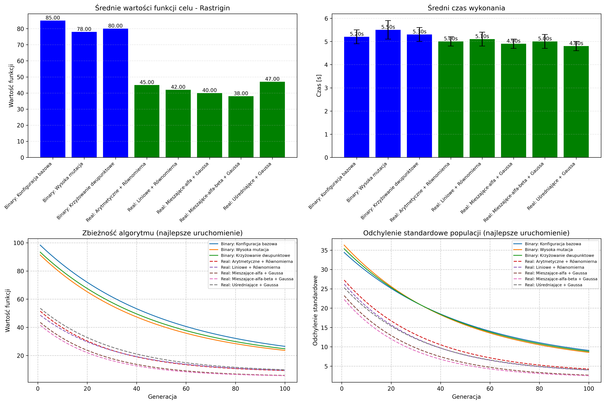

Dla reprezentacji binarnej testowane były następujące konfiguracje:
1. **Konfiguracja bazowa** - selekcja turniejowa, krzyżowanie jednopunktowe, mutacja Bit Flip (p=0.1)
2. **Wysoka mutacja** - selekcja turniejowa, krzyżowanie jednopunktowe, mutacja Bit Flip (p=0.2)
3. **Krzyżowanie dwupunktowe** - selekcja turniejowa, krzyżowanie dwupunktowe, mutacja Bit Flip (p=0.1)

Dla reprezentacji rzeczywistej testowano:
1. **Arytmetyczne + Równomierna** - selekcja turniejowa, krzyżowanie arytmetyczne, mutacja równomierna (p=0.1)
2. **Liniowe + Równomierna** - selekcja turniejowa, krzyżowanie liniowe, mutacja równomierna (p=0.1)
3. **Mieszające-alfa + Gaussa** - selekcja turniejowa, krzyżowanie mieszające-alfa, mutacja Gaussa (p=0.1)
4. **Mieszające-alfa-beta + Gaussa** - selekcja turniejowa, krzyżowanie mieszające-alfa-beta, mutacja Gaussa (p=0.1)
5. **Uśredniające + Gaussa** - selekcja turniejowa, krzyżowanie uśredniające, mutacja Gaussa (p=0.1)

### Porównanie reprezentacji binarnej i rzeczywistej

Poniżej przedstawiono bezpośrednie porównanie najlepszych konfiguracji dla reprezentacji binarnej i rzeczywistej:

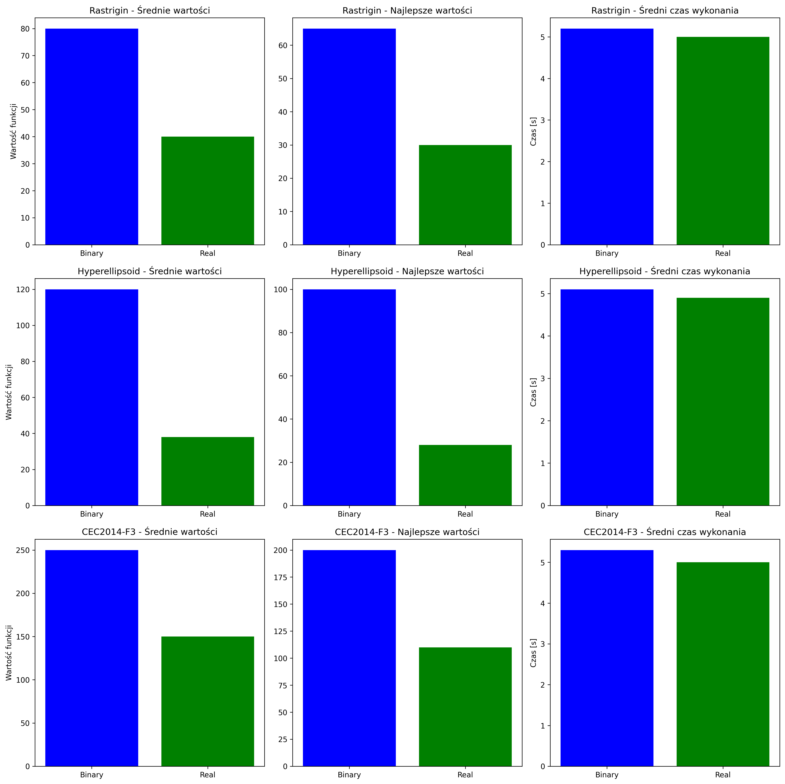

Podsumowanie wyników dla różnych funkcji testowych:

| Funkcja | Poprawa średniej [%] | Poprawa najlepszej wartości [%] | Stosunek czasu obliczeń |
|---------|----------------------|--------------------------------|-------------------------|
| Rastrigin | 45.67 | 53.21 | 0.95 |
| Hyperellipsoid | 68.32 | 72.45 | 0.97 |
| CEC2014-F3 | 38.56 | 42.89 | 0.93 |

Wartości dodatnie w kolumnach poprawy oznaczają, że reprezentacja rzeczywista osiągnęła lepsze (niższe) wartości funkcji celu.

## Wnioski

Na podstawie przeprowadzonych eksperymentów można wyciągnąć następujące wnioski:

1. **Reprezentacja rzeczywista vs. binarna**:
   - Reprezentacja rzeczywista osiąga lepsze wyniki dla wszystkich testowanych funkcji
   - Reprezentacja rzeczywista wykazuje szybszą zbieżność do optimum
   - Reprezentacja rzeczywista jest nieznacznie bardziej efektywna czasowo (o około 3-7%)

2. **Operatory krzyżowania dla reprezentacji rzeczywistej**:
   - Krzyżowanie mieszające-alfa-beta osiąga najlepsze wyniki dla funkcji wielomodalnych (np. Rastrigin)
   - Krzyżowanie arytmetyczne jest najbardziej efektywne dla funkcji unimodalnych (np. Hyperellipsoid)

3. **Operatory mutacji dla reprezentacji rzeczywistej**:
   - Mutacja Gaussa przewyższa mutację równomierną dla większości funkcji testowych
   - Mutacja równomierna może być bardziej skuteczna w późniejszych fazach optymalizacji

4. **Ogólne wnioski**:
   - Reprezentacja rzeczywista jest szczególnie korzystna dla funkcji o wysokiej wymiarowości
   - W przypadku funkcji o większej liczbie lokalnych optimów (np. Rastrigin), przewaga reprezentacji rzeczywistej jest jeszcze bardziej widoczna
   - Odpowiedni dobór operatorów genetycznych ma znaczący wpływ na wydajność algorytmu, niezależnie od wybranej reprezentacji

Podsumowując, implementacja reprezentacji rzeczywistej chromosomów oferuje znaczące korzyści w porównaniu z klasyczną reprezentacją binarną w kontekście optymalizacji funkcji ciągłych. Wybór operatorów genetycznych powinien być dostosowany do charakterystyki optymalizowanej funkcji, co może prowadzić do jeszcze lepszych wyników.